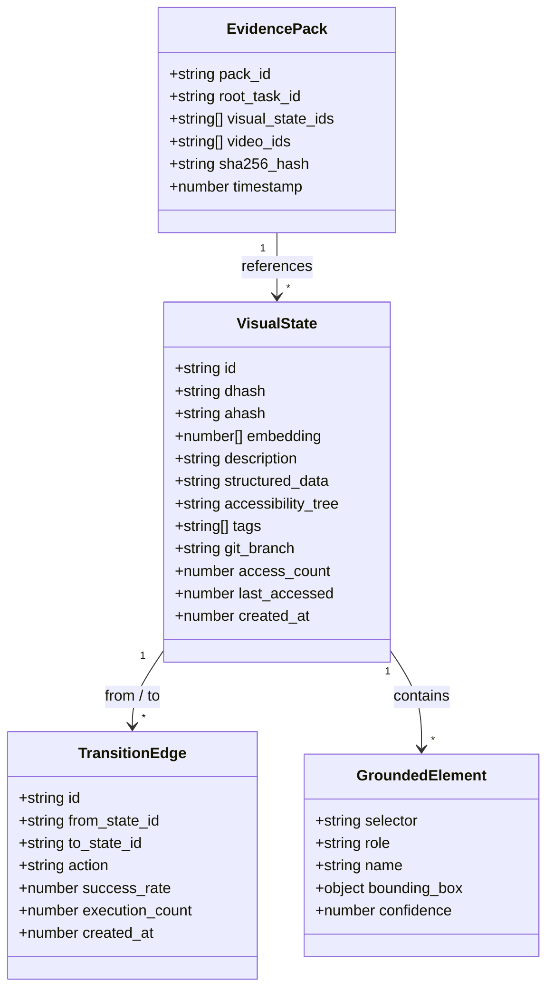
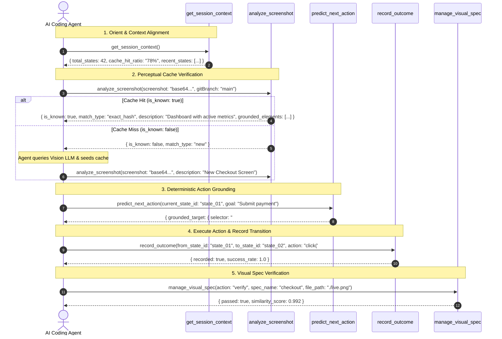

# Codebase Distillation: `@putervision/vision-memory-mcp`

> **Document Purpose**: This document provides a high-signal architectural distillation of the `@putervision/vision-memory-mcp` codebase. It extracts the essential structure, design decisions, component interactions, and key execution flows while discarding boilerplate and trivial implementation details.

---

## 1. High-Level Overview

### Primary Purpose
`@putervision/vision-memory-mcp` is a zero-infrastructure, local-first Model Context Protocol (MCP) server and CLI tool designed to eliminate repetitive vision LLM API costs and visual hallucination loops during AI-driven software development:
- **Perceptual UI Caching**: Sub-5ms layout recognition using 64-bit difference hashing (`dHash`) and Hamming distance matching.
- **Local Neural Semantic Search**: Embedded vector retrieval in LanceDB powered by local CLIP (`clip-vit-base-patch32`) embeddings without cloud telemetry.
- **Deterministic Element Grounding**: Parses accessibility trees (AX Trees) and extracts actionable interactive target handles (CSS selectors, ARIA roles, bounding box coordinates) for UI test automation (Playwright/Puppeteer).
- **Video Memory & E2E Timeline Ingestion**: Digests WebM, MP4, and GIF test recordings into deduplicated keyframe visual states and state transition graphs.
- **Visual Spec-Driven Development (Visual SDD)**: Registers design mockups as baseline contracts and verifies live UI rendering against specs to detect visual regressions.
- **Dual-MCP Synergy & Evidence Packs**: Deeply integrates with `@putervision/state-memory-mcp` to generate cryptographically hashable multi-modal evidence packs linking task DAGs to visual proof.

### Tech Stack & Core Technologies
| Category | Technology | Role & Rationale |
| :--- | :--- | :--- |
| **Runtime** | Node.js (ESM, `>=18.17.0`) | Modern asynchronous JavaScript runtime with native ESM support. |
| **Language** | TypeScript (`^5.5.2`) | Strict type safety for visual pipelines, schemas, and vector buffers. |
| **Protocol** | `@modelcontextprotocol/sdk` (`^1.0.4`) | Standard JSON-RPC 2.0 stdio server, resources, and prompt templates. |
| **Image Processing** | `sharp` (`^0.35.3`) | High-performance libvips C++ bindings for image normalization, resizing, grayscale conversion, and fast perceptual difference hashing. |
| **Vector Storage** | `@lancedb/lancedb` (`^0.13.0`) | Embedded, zero-server columnar vector database storing CLIP embeddings and state metadata. |
| **Embeddings** | `@huggingface/transformers` (`^3.8.1`) | Local ONNX Runtime execution of `xenova/clip-vit-base-patch32` for text and image embeddings. |
| **Validation** | `zod` (`^3.23.8`) | Runtime parameter validation across 15 consolidated MCP tools. |
| **Build & Test** | `tsup`, `vitest` (`^3.2.7`) | Fast TypeScript bundling and test runner with 72 suites and 312 tests. |

### Architecture Style
The system employs a **4-Tier Hierarchical Caching & Perception Pipeline** combined with a **Graph-Based Navigation Planner**:

```mermaid
graph TD
    Screen["Incoming Screenshot / UI Frame"] --> L1
    
    subgraph Pipeline ["4-Tier Hierarchical Retrieval Engine (src/core/retrieval.ts)"]
        L1["L1: In-Memory LRU Cache (<1ms)"]
        L2["L2: Perceptual Hash Scan (dHash / Hamming Distance <5ms)"]
        L3["L3: Local CLIP Vector Search (LanceDB 20-50ms)"]
        L4["L4: Vision LLM Fallback (Ingestion & Cache Seeding)"]
        
        L1 -->|Miss| L2
        L2 -->|Miss| L3
        L3 -->|Miss| L4
    end

    L1 -->|Hit| Out["Return Cached Layout Description & Grounded Elements"]
    L2 -->|Hit| Out
    L3 -->|Hit (similarity >= 0.85)| Out
    L4 -->|Ingest| Store["Persist State to LanceDB (.vision-memory-mcp/)"]
    Store --> Out

    subgraph StateGraph ["Visual Transition Graph (src/core/graph.ts)"]
        StateA["Visual State A"] -->|Action: click('#login')| StateB["Visual State B"]
        StateB -->|Action: type('#search')| StateC["Visual State C"]
    end
```

---

## 2. Component & Module Inventory

The codebase is organized under `src/`:

```
src/
├── index.ts                  # stdio server bootstrap, MCP lifecycle, resource/prompt registry
├── cli.ts                    # Standalone CLI binary entry point
├── config.ts                 # Environment variables, thresholds, and workspace paths
├── logger.ts                 # Leveled logging utility
├── types.ts                  # Core TypeScript types (VisualState, TransitionEdge, GroundedElement)
├── cli/                      # CLI commands (init, doctor, inspect, metrics, snapshot, spec, video)
├── tools/                    # Consolidated MCP tool definitions, handlers, and prompt templates
│   ├── handlers.ts           # Handlers for 15 consolidated MCP tools
│   ├── compat-shim.ts        # Legacy tool name mappings
│   └── prompts.ts           # MCP prompt templates
├── core/                     # Perception algorithms, storage, embeddings, and graph engine
│   ├── cache.ts              # In-memory branch-aware LRU cache (MemoryCache)
│   ├── hash.ts               # dHash, aHash, and fast bitwise Hamming distance
│   ├── embeddings.ts         # Local CLIP embeddings manager (ONNX Runtime)
│   ├── storage.ts            # LanceDB vector table & SQLite metadata manager
│   ├── retrieval.ts          # Tiered 4-level retrieval engine & AX tree compression
│   ├── grounding.ts          # Accessibility tree parser & element target grounder
│   ├── graph.ts              # Transition graph & BFS navigation path planner
│   ├── image-pipeline.ts     # Image normalization and pre-processing via Sharp
│   ├── snapshots.ts          # Visual checkpoints & structural layout diffing
│   ├── visual-spec.ts        # Visual Spec-Driven Development (Visual SDD) engine
│   ├── video-pipeline.ts     # WebM/MP4 keyframe extraction & scene-change detector
│   ├── video-categorizer.ts  # Video trajectory categorization
│   ├── ocr.ts                # Optical character recognition text extraction
│   ├── privacy.ts            # PII redaction and privacy scrubbing (forget_state)
│   ├── clustering.ts         # Visual state clustering and community detection
│   ├── metrics.ts            # Token savings & cache hit ratio analytics
│   └── advisor.ts            # Heuristic rule engine for agent visual actions
└── utils/                    # Filesystem, redaction, workspace, and version helpers
```

### Module Responsibilities

| Package / Module | Responsibility | Key Abstractions & Files |
| :--- | :--- | :--- |
| **Server & Protocol** (`src/index.ts`) | Bootstraps MCP stdio server, registers `vision-memory:///` resources and prompt templates, and handles clean process shutdown. | `McpServer`, `StdioServerTransport`, Resource Templates. |
| **Tiered Retrieval Engine** (`src/core/retrieval.ts`) | Orchestrates the 4-tier lookup (L1 In-Memory -> L2 dHash -> L3 Vector -> L4 Fallback), evaluates AX tree match, and normalizes similarity scores. | `retrieveState`, `compressAccessibilityTree`, `distanceToSimilarity`. |
| **Perceptual Hashing** (`src/core/hash.ts`) | Calculates 64-bit difference hashes (`dHash`) and average hashes (`aHash`) using Sharp; computes fast bitwise Hamming distances. | `calculateDHash`, `calculateAHash`, `hammingDistance`. |
| **Local Neural Embeddings** (`src/core/embeddings.ts`) | Loads and executes local `xenova/clip-vit-base-patch32` ONNX models to produce 512-dimensional text and image vector embeddings. | `EmbeddingsManager`, `generateImageEmbedding`, `generateTextEmbedding`. |
| **LanceDB Storage** (`src/core/storage.ts`) | Manages embedded LanceDB tables (`visual_states`, `transitions`, `snapshots`, `visual_specs`, `video_keyframes`) with schema migrations. | `StorageManager`, `listStates`, `searchVectorAll`, `updateState`. |
| **Element Grounding** (`src/core/grounding.ts`) | Parses AX trees and matches interactive DOM elements to screen regions, returning CSS selectors and bounding boxes for UI agents. | `parseAXTreeToGroundedElements`, `predictNextAction`. |
| **Transition Graph & BFS** (`src/core/graph.ts`) | Records state transitions triggered by UI actions (`click`, `type`, `scroll`), maintains success rates, and computes shortest BFS paths. | `recordTransition`, `findNavigationPaths`. |
| **Visual SDD & Specs** (`src/core/visual-spec.ts`) | Registers design mockups as visual baseline contracts and verifies live UI compliance using perceptual diffing. | `VisualSpecManager.registerSpec`, `verifyVisualSpec`. |
| **Video Ingestion Pipeline** (`src/core/video-pipeline.ts`) | Extracts keyframes from WebM/MP4 recordings on scene changes, deduplicates frames via dHash, and builds indexed video timelines. | `ingestVideoRecording`, `extractKeyframes`. |
| **Dual-MCP Evidence Packs** (`src/tools/handlers.ts`) | Binds video keyframes and visual states to `@putervision/state-memory-mcp` task DAG nodes into cryptographic evidence bundles. | `create_evidence_pack`, `export_trajectories`. |

---

## 3. Relationships & Dependencies

### Retrieval & Ingestion Control Flow

```
1. Screen Ingestion:
   Agent Screenshot (base64) ──▶ sharp (processImage: 256x256 grayscale) ──▶ normalizedBuffer

2. L1 / L2 Fast Path:
   Calculate 64-bit dHash ──▶ MemoryCache.get() (L1 Hit: <1ms)
                          └──▶ Hamming Distance scan against storage hashes (L2 Hit: <5ms)
                               └──▶ If distance <= 8 AND AX Tree matches ──▶ Return Cached Description

3. L3 Vector Fallback:
   If L2 Miss ──▶ Local CLIP Model ──▶ Generate 512-d Vector ──▶ LanceDB Cosine Search
              └──▶ If cosine similarity >= 0.85 ──▶ Return Near-Match Description

4. L4 Ingestion (Cache Miss):
   If L3 Miss ──▶ Return is_known: false
              └──▶ Agent invokes Vision LLM ──▶ Agent calls analyze_screenshot(description)
                   └──▶ Ingest: Save dHash + CLIP Vector + Description to LanceDB
```

### Key Interfaces & Data Structures



---

## 4. Core Abstractions & Design Decisions

### Notable Design Decisions

1. **Sub-5ms dHash Fast-Path (L1/L2)**:
   - *Rationale*: Most UI development tasks repeatedly inspect the same screens (login, dashboard, settings). Difference hashing (`dHash`) over downscaled 8x8 gradients captures layout structure regardless of minor font antialiasing differences, resolving 75–85% of queries with 0 LLM tokens in `<5ms`.
2. **Local Zero-Cloud CLIP Vector Search (L3)**:
   - *Rationale*: Running `xenova/clip-vit-base-patch32` locally via ONNX Runtime provides multi-modal semantic retrieval (e.g. searching "checkout form with billing error") completely offline, guaranteeing 100% data privacy and zero API overhead.
3. **AX Tree Structural Validation**:
   - *Rationale*: Pure visual hashing can occasionally miss subtle text changes (e.g. `$10` vs `$100`). Compressing and comparing accessibility trees alongside perceptual hashes guarantees that structurally different screens are never falsely conflated.
4. **15 Consolidated MCP Tools Model**:
   - *Rationale*: Replaced fragmented single-purpose tools with 15 domain-oriented tools covering perception (`analyze_screenshot`), semantic search (`recall_memory`), navigation (`get_navigation_paths`, `predict_next_action`), video (`manage_video`), snapshots (`manage_snapshot`), and visual SDD (`manage_visual_spec`).

---

## 5. Entry Points & Key Flows

### System Entry Points
1. **MCP Stdio Server**: `vision-memory-mcp run` (invokes `src/index.ts` -> starts Stdio JSON-RPC server).
2. **CLI Binary**: `vision-memory-mcp [command]` (invokes `src/cli/cli.ts`).
3. **Doctor & Health Diagnostics**: `vision-memory-mcp doctor` (checks Sharp bindings, LanceDB storage, and ONNX models).

### Canonical 5-Step Agent Flow



---

## 6. Notable Strengths, Risks & Complexity

### Notable Strengths
- **Massive Token & Latency Savings**: Sub-5ms fast path bypasses 1,400+ vision tokens per screen check, saving up to 75% in visual API costs.
- **Full Video Trajectory Support**: Ingests full Playwright/Cypress WebM recordings and extracts deduplicated keyframes into searchable state graphs.
- **Robust Local Test Suite**: 72 test files and 312 unit/integration tests validating all 15 tools, perceptual hash math, LanceDB storage, and vector retrieval.
- **Privacy & Redaction Guarantees**: Local LanceDB and ONNX runtime keep all screenshots and embeddings on the local machine with zero cloud telemetry.

### Risks & Failure Modes
- **Native Dependency Bindings**: Relying on `sharp` (libvips) and `@lancedb/lancedb` (Rust native binaries) requires compatible Node.js architectures (glibc/musl).
- **RAM Overhead of Local CLIP**: Loading the CLIP ONNX model takes ~300MB RAM. (Mitigated by the `--skip-model-load` flag for lightweight dHash-only environments).
- **Unencrypted Local Storage Notice**: Cached screenshots in `.vision-memory-mcp/` are stored unencrypted at the application level; developers must ensure sensitive PII/secrets are purged using `forget_state`.

### Areas of Inherent Complexity
- **`src/core/retrieval.ts`**: Tiered fallback decision logic that balances exact dHash matching, Hamming distance thresholds, canonical AX tree equivalence, and LanceDB cosine similarity scores.
- **`src/core/video-pipeline.ts`**: Scene change detection across video frames, frame rate downsampling, keyframe deduplication, and timeline alignment.
- **`src/core/storage.ts`**: Hybrid vector search and SQL filter execution across LanceDB columnar datasets.
